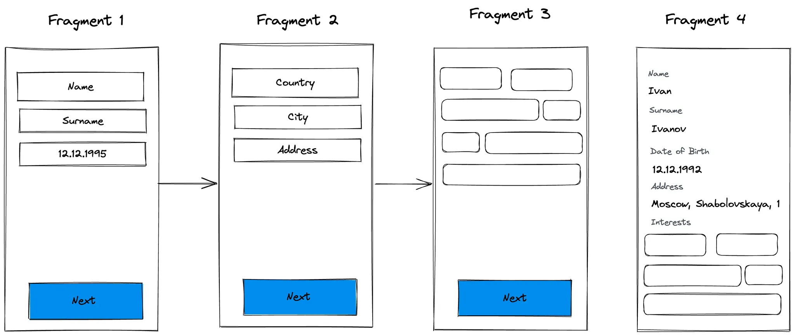
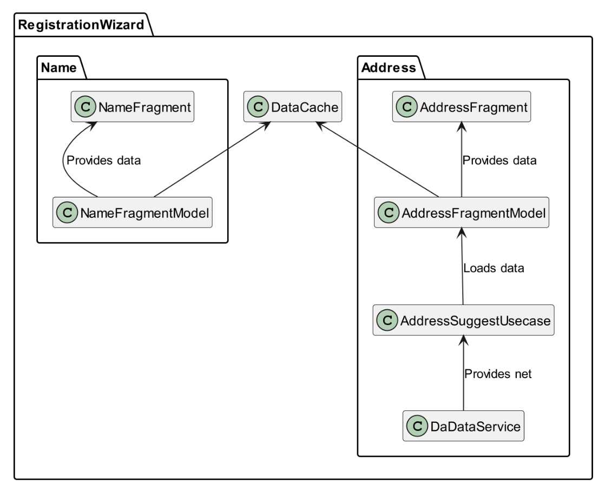

# Домашняя работа "Архитектура Android приложения"

Эта домашняя работа покрывает три темы домашних заданий:

1. Архитектура MVVM для создания визарда регистрации пользователя.
2. Работа с сетью - валидация адреса пользователя.
3. Unit-тестирование.

Выполняйте задания в отдельных коммитах одного пулл-реквеста. Добавляйте коммиты по мере изучения материала.

## Задание 1. Архитектура MVVM для создания визарда регистрации пользователя

В этом задании реализуем wizard экран-анкету приложения для знакомств:

1. На первом фрагменте добавьте формы ввода имени, фамилии и даты рождения(добавьте маску в EditText и валидацию 18+). 
   Если валидация не прошла, показывайте тост с ошибкой и блокируйте кнопку Далее.
2. На втором фрагменте добавьте формы ввода: страны, города и адреса(улица + дом).
3. На третьем выберите облако тегов из интересов (массив интересов заполните самостоятельно).
4. На четвертом экране выведите всю введенную информацию.

### Требования:

- Реализуйте задания используя паттерн Single Activity, все вложенные экраны должны быть фрагментами.
- В качестве архитектурного паттерна используйте MVVM, валидацию, получение данных(облако тегов) распределите по правильным классам. 
  Используйте `ViewModel` и `LiveData` или `StateFlow`.
- При переходе с одного экрана на другой, сохраняйте информацию в in memory-хранилище `WizardCache`, его реализуйте самостоятельно. 
- Используйте Dagger2 или Hilt для того чтобы получать экземпляр `WizardCache` в `ViewModel`’ях фрагментов.

## Задание 2. Работа с сетью - валидация адреса пользователя

В этой домашней работе мы добавим сетевое взаимодействие.

- На втором экране(ввода адреса) объедините 3 поля для ввода в одно
- Добавьте к этому инпуту подсказки используя АПИ [Дадата](https://dadata.ru/api/#address-suggest). Когда пользователь начинает вводить свой город и улицу, 
  он должен увидеть предлагаемые варианты, которые приходит из Дадаты.
- В качестве сетевого клиента используйте Retrofit.
- Используйте suspend функции и корутины для асинхронного запроса в сеть. Корутины запускайте во ViewModel. Не забудьте про обработку ошибок и отмену корутин.
- Продумайте безопасное хранение ключа сервиса Дадата, например, в `local.properties`. Для этого можно воспользоваться плагином [secrets-gradle-plugin](https://github.com/google/secrets-gradle-plugin).
- Использование интерцептора для добавления заголовка с ключом сервиса Дадата приветствуется!

## Задание 3. Unit-тестирование

- Напишите unit-тесты для функции или модели валидации ввода на первом экране.
- Напишите unit-тесты для ViewModel, которая делает запрос в сеть и обрабатывает ответ. Для этого продумайте, как можно замокать сетевое API во ViewModel.
